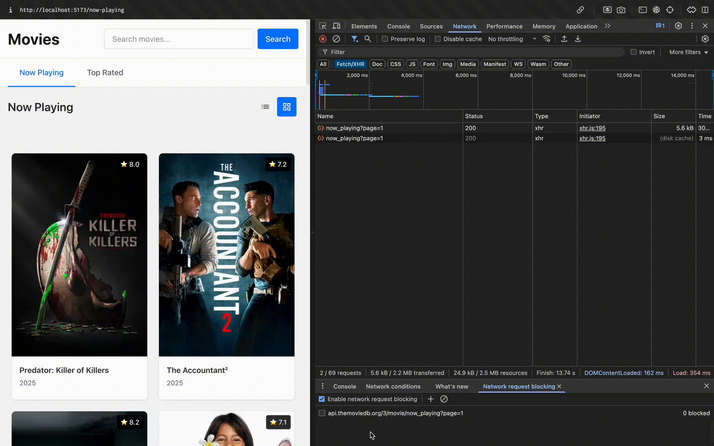

# Project - *Movies*

**Movies** is a movies app using the [The Movie Database API](https://developers.themoviedb.org/3).

- Total time: 72 hours (please no more!)

## User Stories

The following **required** functionality is completed:

- [x] User can view a list of movies currently playing in theaters. Poster images load asynchronously.
- [x] Add a tab bar for **Now Playing** and **Top Rated** movies.
- [x] Add a search bar.
- [x] User can view movie details by tapping on a cell.
- [x] User sees loading state while waiting for the API.
- [x] User sees an error message when there is a network error.
- [x] Simple responsive.

The following **optional** features are implemented:

- [x] Implement segmented control to switch between list view and grid view.
- [ ] All images fade in.
- [x] Implement lazy load image.
- [x] Customize the highlight and selection effect of the cell.
- [x] Improve UX loading by skeleton loading.
- [x] Enhance responsive.

The following **additional** features are implemented:

- [x] Sticky header navigation
- [x] Hover animations and transitions

## Requirements

- Please use ReactJS with typescript
- Please use SCSS
- Please do not use any CSS/SCSS framework or UI library

## Video Walkthrough

Here's a walkthrough of implemented user stories:




## Submit

### ✅ **Core Features Implemented:**
- **Movie Listings**: Now Playing and Top Rated movies with tab navigation
- **Search Functionality**: Movie search with responsive results
- **Movie Details**: Comprehensive detail pages with poster images and movie information
- **Responsive Design**: Optimized for desktop, tablet, and mobile devices
- **Loading States**: Skeleton loading animations for better UX
- **Error Handling**: Network error states with user-friendly messages

### ✅ **Enhanced User Experience:**
- **View Toggle**: Segmented control to switch between list and grid layouts
- **Lazy Loading**: Optimized image loading for better performance
- **Interactive Elements**: Custom hover animations and cell selection effects
- **Sticky Navigation**: Fixed header for seamless browsing
- **Modern UI**: Clean, intuitive interface following best UX practices

### 🛠 **Technical Implementation:**
- **React 19** with TypeScript for type safety
- **React Query** for efficient API state management
- **React Router 7** for navigation
- **Vite** for fast development and optimized builds
- **SCSS** for modular styling (no external CSS frameworks)
- **The Movie Database API** integration

### 🚀 **Build Instructions:**
```bash
# Install dependencies
yarn install

# Start development server
yarn dev

# Build for production
yarn build

# Preview production build
yarn preview
```

The application runs on `http://localhost:5173` in development mode.
